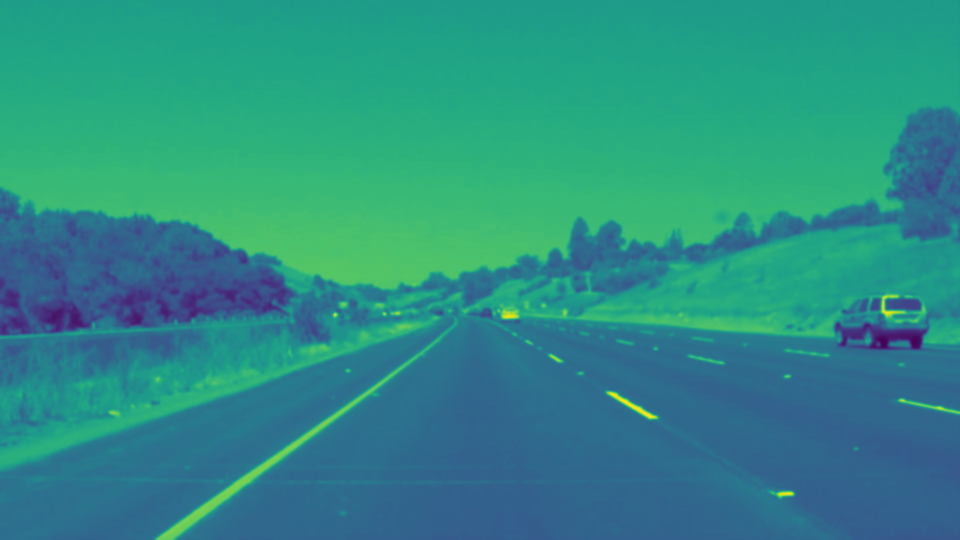
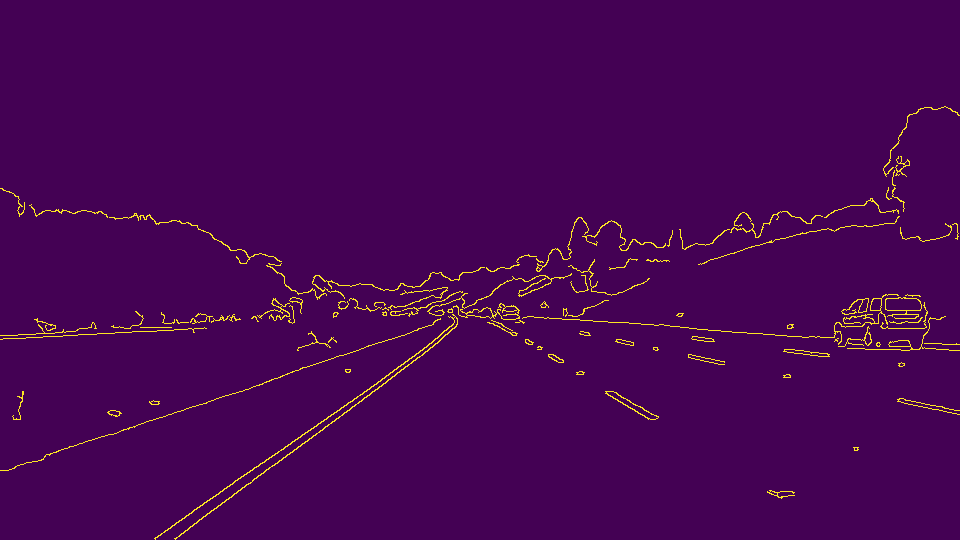
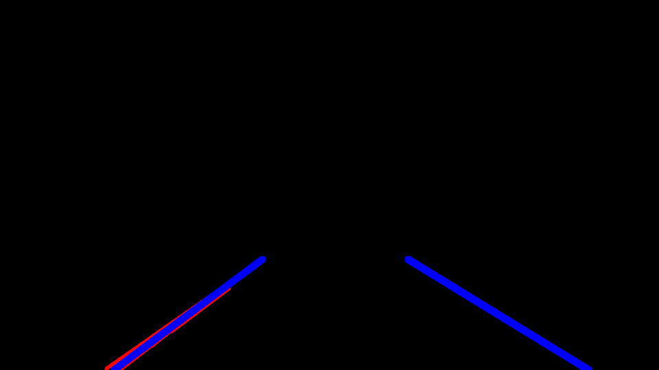
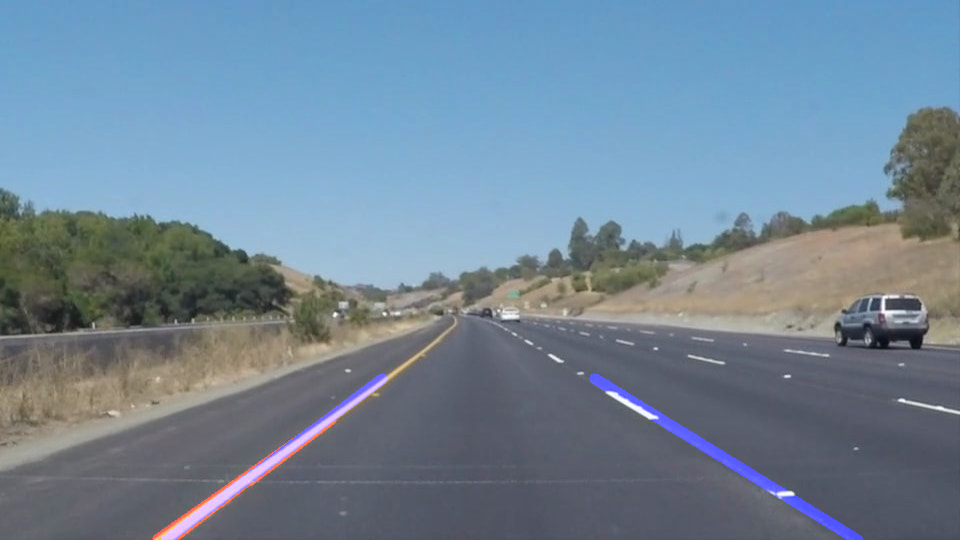

# **Finding Lane Lines on the Road** 

---

The goals / steps of this project are the following:
* Make a pipeline that finds lane lines on the road
* Reflect on your work in a written report

---

## Reflection

### 1. Goals
 
My goal was to build on edge detection techniques prototyped in earlier sections of the project by providing the best lane edge line-building capabilities I could in the time provided. 

Towards that end, I chose to stick with the default edge detection algorithm parameters used before (e.g., a gaussian blur kernel size of 5) rather than divide attention from the stated objective. There is substantial opportunity to optimize these parameters that would be valuable to explore, however.    

My chosen approach induced challenges such as spurious, odd-angled lines found in the "challenge.mp4" video. These were great opportunities to drill down on important aspects of this capability such as line filtering with (in my opinion) good, overall results
 
### 2. Processing Pipeline 

My pipeline consisted of the following steps:
1. Edge detection, including the following: 
    1. Conversion of input frame to grayscale
    
    2. Gaussian blur
    
    3. Canny edge detection
    
    4. Masking to a bottom-center, quadrilateral area
    
2. Line building, including the following:
    1. Hough transform and line generation, as follows:
    
        1. First drawing all *detected* lines in RED
        2. Then drawing all *averaged* lane edges in BLUE, as follows:
            1. Computing line slope
            2. Distinguishing left/right sloped lines
            3. Filtering out the following:
                1. Vertical lines
                2. Shallow lines (i.e., slope absolute value less than/equal to 0.5)
                3. Off-side lines (e.g., left-sloped on the left side)
            4. Weighting remaining lines, as follows:
                1. By length, biasing longer
                2. By slope, biasing steeper
            5. Identifying the following for left-/right-sided lines:
                1. Weighted, mean slope
                2. Weighted, mean center point
            6. Drawing left-/right-sided lane edge lines, as follows:
                1. Computing the following based on previous 10 frames:
                    1. Mean slope
                    2. Mean bottom-edge intercepts
                2. Computing top-edge intercepts
                3. Drawing lines from bottom to top-edge intercepts
    6. Compositing an output frame from results of the above
    

Example result (video):

### 3. Potential Shortcomings

This capability is optimized for the supplied example videos, suggesting the following limitations:
* Front-facing camera
* Centrally-placed
* Minimal occlusion and fouling
* Stable, vibration-damped mounting
* Specific speeds of travel and lane orientation 
* Specific times of day and sun position (i.e., not head-on)
* Specific road surfaces and conditions
* Specific vertical deflection, field-of-view and other characteristics

Conditions outside of the above will weaken or negate this capability.

### 4. Possible Improvements

This capability's limitations are aggravated by minimal attention paid to optimizing the edge detection phases of the pipeline. 

There is substantial opportunity in this phase for the following:
* Lessening filtering requirements of the line-building phase, improving its overall effectiveness
* Adapting to important environmental variations such as sun angle (e.g., shadows, glare)

Additionally, project code could be more modular with better commentary. 
